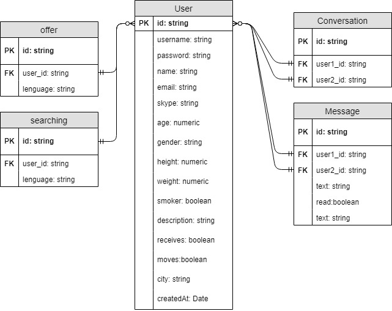

# LANGCHANGE Documentation

## Intro

This application is a useful tool for people who want to learn languages through the use of language in conversations. Through it you will be able to meet people close to you who offer those languages you want to learn and with interests similar to yours.

<!-- ### Screen Shots

 -->

## Functional description

Langchange allows its users to search for people in a given area based on the languages they are offering and the languages they are seeking to learn, in addition to other criteria to facilitate the connection between compatible people.

As a user you can fill in your profile with information about the languages you want to learn, those you want to teach, a description, a photo, your city, and more personal data such as your age, physical and habits.  All this information will help the rest of users to find you and encourage them to contact you.

To communicate users can do so through the email shown in the profile, skype or chat that includes the web itself. 

## Use Cases Diagram

## Technical description

The application is a web application that is able to run either with a browser environment, mobile phone or tablet. It consists of a ReactJS frontend. The react-logic connects to Langchange-api that uses:

- NodeJs
- Express
- Sequelize (ORM)
- MySQL

The application is written in ES6 and user data is persistent across page reloads, as users data is stored in the user's SessionStorage and token.  

## Blocks Diagram

## Components Diagram

## Sequences Diagram

- search

## Data Model Diagram

 

## Author

Sergio Luz Fernandez - [GitHub](https://github.com/sergioluz90)